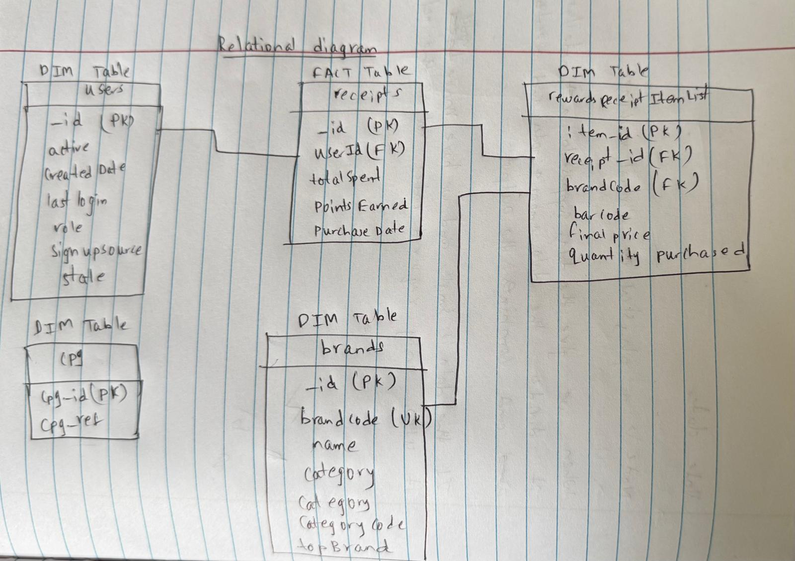

This file provides an overview of the project, explains the approach to each section, and includes links to relevant files.

---

# Fetch Rewards Coding Exercise - Analytics Engineer

This repository contains my submission for the Fetch Rewards Analytics Engineer Coding Exercise. The goal is to demonstrate how I reason about data, design a structured data model, write SQL queries, evaluate data quality, and communicate findings to stakeholders. Below, I outline my approach to each part of the exercise, including code, diagrams, and notes.

---

## Project Overview

The exercise involves:
1. Reviewing unstructured JSON data and designing a structured relational data model.
2. Writing SQL queries to answer business questions.
3. Identifying data quality issues.
4. Communicating findings to a business stakeholder.

I used **SQLite** as the SQL dialect and Python for data processing. All code, outputs, and documentation are committed to this repository.

---

## Files in This Repository

- **`data/input_data/`**: raw data which is in .json.gz format.
- **`data/output_data/`**: CSV files generated from JSON data (`receipts.csv`, `users.csv`, `brands.csv`, `rewardsReceiptItemList.csv`, `cpg.csv`).
- **`structured.py`**: Python script to extract, transform, and load JSON data into CSV files.
- **`RelationalDiagram.jpeg`**: Diagram of the star schema (in `images/` folder).
- **`first_question.md`**: Relational model with star schema.
- **`second_question.md`**: SQL queries for business questions.
- **`third_question.md`**: Data quality issues identified.
- **`fourth_question.md`**: Stakeholder communication (email draft).

---

## Part 1: Structured Relational Data Model

### Approach
I reviewed the provided JSON files (`receipts.json.gz`, `users.json.gz`, `brands.json.gz`) and designed a star schema with `receipts` as the fact table and `users`, `rewardsReceiptItemList`, `brands`, and `cpg` as dimension tables. Nested data (e.g., `rewardsReceiptItemList` in `receipts` and `cpg` in `brands`) was extracted into separate tables.

### Diagram

### Details
- See [structured.py](https://github.com/jeethesh333/Coding_Exercise/blob/main/structured.py) for extraction and transformation logic.
- Nested data was "exploded" using Pandas (`explode` and `json_normalize`).
- Used NLP techniques to extract brands from description. although, it is not 100% accurate, I believe this is a approach that we can do to eaxtract as there is not enough information.
- CSV files were generated for SQLite import (`data/output_data/`).

---

## Part 2: SQL Queries for Business Questions

I chose three questions from the list and wrote SQLite queries against my star schema. See [queries.sql](https://github.com/jeethesh333/Coding_Exercise/blob/main/queries.sql) and [second_question.md](https://github.com/jeethesh333/Coding_Exercise/blob/main/second_question.md) for full details.

I answered questions(1,3,& 4).

---

## Part 3: Data Quality Issues

I evaluated the data for quality issues using Python and SQL, documented in [third_question.md](https://github.com/jeethesh333/Coding_Exercise/blob/main/third_question.md). Key findings:
- **Duplicates in `users._id`**: Removed as it’s a PK.
- **Missing `brandCode` in `rewardsReceiptItemList`**: Filled using NLP on `description` (e.g., "DORITOS" from "DORITOS TORTILLA CHIP").
- **Isolated `cpg` Table**: No relationships defined.
- **Inconsistent Data Types**: `barcode` (REAL in `brands`, TEXT in `rewardsReceiptItemList`); dates as TEXT.
- **Test Data in `brands.brandCode`**: e.g., "TEST BRANDCODE @1598635634882".
- **Missing/Zero Values**: `totalSpent` has 0.0 or null values despite `bonusPointsEarned`.

See [structured.py](https://github.com/jeethesh333/Coding_Exercise/blob/main/structured.py) for cleaning steps (e.g., duplicate removal, NLP brand extraction).

---

## Part 4: Stakeholder Communication

I drafted an email to a business leader, focusing on clarity and collaboration. Full text is in [fourth_question.md](https://github.com/jeethesh333/Coding_Exercise/blob/main/fourth_question.md). Highlights:
- **Questions**: Purpose of `cpg`, accuracy needed for brand guesses, handling test codes.
- **Discovery**: Found issues by cross-checking tables and testing links.
- **Needs**: Partner file, `cpg` context, sample receipts, priority list, data source info.
- **Optimization**: Asked for business goals, data sources, growth estimates.
- **Performance**: Suggested indexing, fast refreshes, and archiving for scalability.

---

