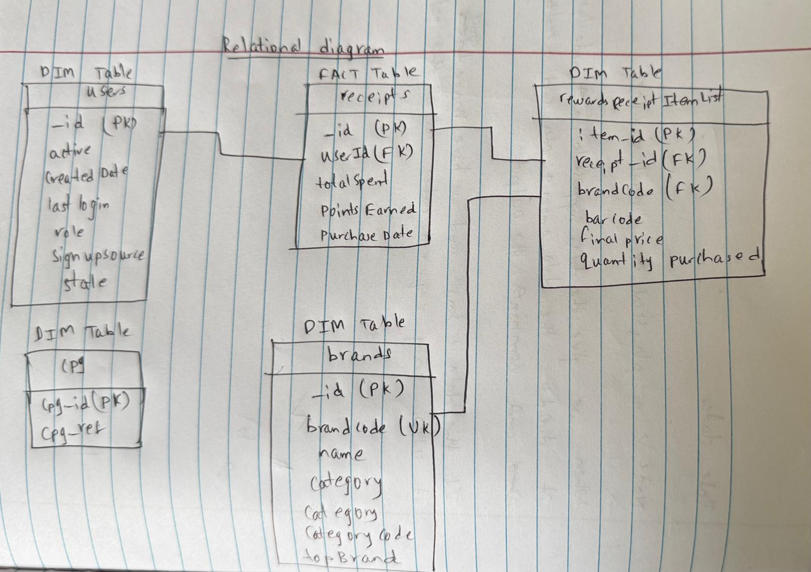

### Relational Diagram (Star Schema with `receipts` as Fact Table)

---

### Explanation of the Diagram

- This structure follows a star schema where receipts is the central fact table, and the other tables act as dimension tables, optimizing for analytical queries.

1. **Fact Table: receipts**
   - **Primary Key**: `_id` 
   - **Foreign Key**: `user_id` (links to `users._id`)
   - **Fields**: Quantitative measures such as `totalSpent`, `pointsEarned`, and descriptive attributes like `purchaseDate`.
   - **Role**: Captures the core transactional data at the receipt level, serving as the central fact table for analyzing purchases (e.g., total spending, points earned per receipt).

2. **Dimension Table: users**
   - **Primary Key**: `_id` 
   - **Fields**: Descriptive attributes like `active` , `createdDate`, and `role`.
   - **Relationship**: Links directly to `receipts` via `_id`, providing the user context for each transaction.

3. **Dimension Table: rewardsReceiptItemList**
   - **Primary Key**: `item_id` 
   - **Foreign Keys**:
     - `receiptId` (links to `receipts._id`)
     - `brandCode` (links to `brands.brandCode`)
   - **Fields**: Descriptive attributes like `barcode`, `finalPrice`, and `quantityPurchased`.
   - **Role**: Provides item-level details for each receipt, acting as a dimension to enrich the transactional data with specifics about purchased items.

4. **Dimension Table: brands**
   - **Primary Key**: `_id` 
   - **Unique Key**: brandCode (unique and used as the foreign key in rewardsReceiptItemList)
   - **Fields**: Descriptive attributes like `name` and `category`.
   - **Relationship**: Links to `rewardsReceiptItemList` via `brand_code`. While `_id` is the primary key, `brand_code` serves as the joinable key in this star schema due to its use in `rewardsReceiptItemList`.

5. **Dimension Table: cpg**
   - **Primary Key**: `cpg_id` 
   - **Fields**: `cpg_ref` 
   - **Relationship**: Standalone in this diagram, as no explicit foreign key relationship is defined in the schema. 

---

### Star Schema Explanation

#### Characteristics of a Star Schema:
- **Fact Table**: A single central table (`receipts`) contains quantitative data (facts) representing the primary events or transactions, such as `totalSpent` and `pointsEarned`.
- **Dimension Tables**: Surrounding tables (`users`, `rewardsReceiptItemList`, `brands`) provide descriptive context and are denormalized, meaning they are not split into additional normalized tables.
- **Direct Relationships**: The fact table connects directly to dimension tables via foreign keys, forming a "star" pattern with minimal intermediate tables.

**Adjustments for Star Schema**:
   - `receipts` is the fact table, directly connected to `users` via `user_id`, adhering to star schema principles of direct dimension links.
   - `rewardsReceiptItemList` acts as a dimension, linked to `receipts` via `receipt_id`. It bridges to `brands`, which is a slight deviation from a pure star (where all dimensions connect directly to the fact table), but this is common in retail schemas where item details are a key context.

#### Notes:
- **Indirect Brand Link**: `brands` connects to `receipts` through `rewardsReceiptItemList` rather than directly. 
- **CPG Table**: Remains unlinked due to no explicit relationship in your schema. It could be integrated as a dimension if tied to `brands` or `rewardsReceiptItemList` (e.g., via a hypothetical `cpg_id` foreign key).
- **Fields Omitted for Clarity**: I’ve included representative fields (e.g., `totalSpent`, `finalPrice`) rather than listing all fields (e.g., `bonusPointsEarned`, `description`) to keep the diagram concise. All original fields remain in their respective tables.

---

[Next question](https://github.com/jeethesh333/Coding_Exercise/blob/main/second_question.md)

