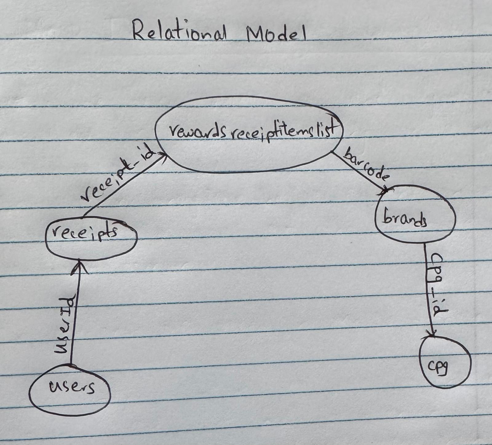
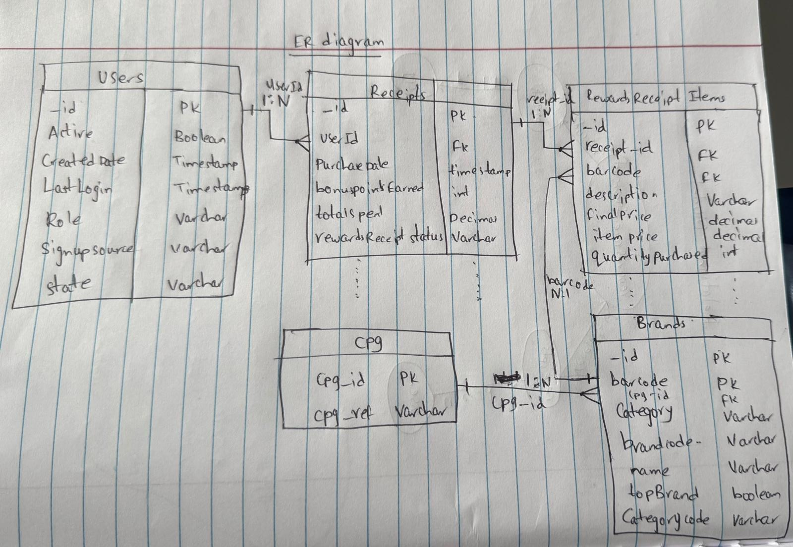

In the initial data provided, there are three files users, brands, receipts. In receipts file there is another table nested
which is rewardsReceiptItemList. In brands table there is another table nested which is cpg. So, instead of three tables now it is five tables.

Assumptions: 
1.For some tables, as there are more columns, I am only writing certain columns to make it easier.  
2.since cpg table doesn't have direct relation with other tables. I am creating cpg_id column in brands table as a refrence to cpg table.

Tables and Relationships:

Users Table (users)
_id (Primary Key) → Joins with receipts.userId
active
createdDate
lastLogin
role
signUpSource
state

Receipts Table (receipts)
_id (Primary Key) → Joins with rewardsReceiptItemList.receipt_id
userId (Foreign Key) → Joins with users._id
purchaseDate
bonusPointsEarned
totalSpent
rewardsReceiptStatus

Rewards Receipt Items Table (rewardsReceiptItemList)
receipt_id (Foreign Key) → Joins with receipts._id
barcode (Foreign Key) → Joins with brands.barcode
description
finalPrice
itemPrice
quantityPurchased

Brands Table (brands)
_id (Primary Key)
barcode (Primary Key) → Joins with rewardsReceiptItemList.barcode
category
brandCode

CPG Table (cpg)
cpg_id (Primary Key)
cpg_ref

This structure follows a star schema where receipts is the central fact table, and the other tables act as dimension tables, optimizing for analytical queries.

Fact Table: receipts (contains purchase transactions)
Dimension Tables: users, brands, cpg, rewardsReceiptItemList

Here is the relational diagram representing how the data is structured in the data warehouse. The diagram illustrates the relationships between the key tables (users, receipts, rewardsReceiptItemList, brands, and cpg).

Here is the ER diagram showing:
Entities (Tables) with attributes
Primary Keys (PK) & Foreign Keys (FK) 
Relationships with cardinality (1:N, N:1)

